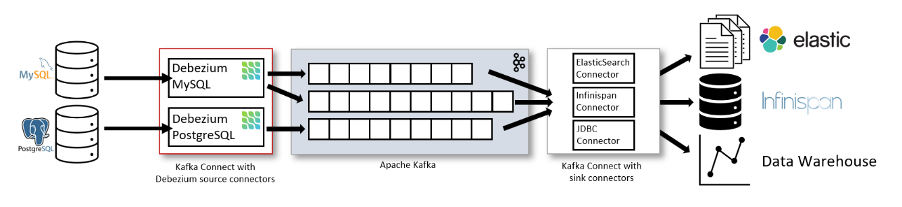

# CDC trong Postgresql với Debezium

## Giới thiệu
Project sử dụng debezium và kafka để đồng bộ hóa dữ liệu giữa các database

## Các thành phần trong docker compose

- Zookeeper: có vai trò quản lý và điều phối các broker trong một kafka cluster
- Kafka: là một message broker, có nhiệm vụ chuyển message từ producer sang consumer
- Postgres-source: database gốc
- Postgres: database cần đồng bộ dữ liệu với database gốc
- Debezium: debezium là một kafka connect, sử dụng các connector để trao đổi dữ liệu giữa database và kafka. Có hai loại connector:

    - Source connector: theo dõi dữ liệu từ database
    - Sink connector: truyển dữ liệu từ kafka đến database

## Work flow



1. Khi datababe gốc có sự thay đổi về dữ liệu, debezium sẽ sử dụng các source connector để phát hiện những thay đổi đã xảy ra với từng record.
2. Debezium sẽ chuyển những thay đổi này sang message và gửi lên kafka.
3. Khi message đã được gửi lên kafka, ta có thể viết chương trình hoặc dùng các sink connector của debezium để đọc message và thực hiện những thay đổi này lên database.

## Setup

1. Chạy file `docker-compose.yml`.
2. Tạo table cho các database (postgres-source, postgres).
3. Để debezium có thể đọc các thay đổi về dữ liệu, database gốc cần bật logical replication:
    - Chạy câu lệnh `ALTER SYSTEM SET wal_level = logical;`
    - Restart container để áp dụng thay đổi
    - Có thể check xem logical replication đã được bật chưa bằng câu lệnh:
    ```
   SELECT name, setting
   FROM pg_settings
   WHERE name IN ('wal_level', 'max_replication_slots');
   ```
4. Tạo user cho debezium source connector trên database gốc với các quyền cần thiết:
   ```
   CREATE ROLE debezium_source WITH REPLICATION LOGIN PASSWORD '123456';
   CREATE ROLE replication_group;
   GRANT replication_group TO admin;
   GRANT replication_group TO debezium_source;
   GRANT CREATE ON DATABASE source TO debezium_source;
   ```
5. Chuyển owner của các table cho user:
   ```
   ALTER TABLE account OWNER TO replication_group;
   ```
6. Tạo source connector trên debezium:
   ```
   curl --location 'http://localhost:8083/connectors' \
   --header 'Content-Type: application/json' \
   --data '{
    "name": "postgres-source-connector",
    "config": {
     "connector.class": "io.debezium.connector.postgresql.PostgresConnector",
     "database.hostname": "postgres-source",
     "database.port": "5432",
     "database.user": "debezium_source",
     "database.password": "123456",
     "database.dbname": "source",
     "database.server.name": "source_db_server",
     "plugin.name": "pgoutput",
     "slot.name": "debezium_slot",
     "publication.autocreate.mode": "filtered",
     "publication.name": "debezium_publication",
     "table.include.list": "public.*",
     "database.history.kafka.bootstrap.servers": "kafka:9092",
     "database.history.kafka.topic": "schema-changes.source_db",
     "topic.prefix": "source-changes"
    }
   }'
   ```
   - Với mỗi table, debezium sẽ tạo một topic trên kafka để truyền message về sự thay đổi của bảng đó. Tên topic có dạng `<topic.prefix>.<schema>.<database_name>`.
   - Khi lần đầu kết nối với Postgre, debezium sẽ tạo một snapshot của tất cả các database và gửi tất cả các record hiện có lên kafka.
   - Vì topic chỉ được tạo khi message đầu tiên được debezium gửi lên kafka, vậy nên nếu table ko có record nào, ta phải tạo một test record để topic được khỏi tạo trên kafka. VD: `INSERT INTO account(username,password) VALUES('testAccount','123456');`
7. Tạo user cho debezium sink connector trên database cần đồng bộ với các quyền cần thiết để thực hiện thay đổi:
   ```
   CREATE USER debezium_sink WITH PASSWORD '123456';
   GRANT CONNECT ON DATABASE target TO debezium_sink;
   GRANT USAGE ON SCHEMA public TO debezium_sink;
   GRANT INSERT, UPDATE, DELETE, SELECT ON ALL TABLES IN SCHEMA public TO debezium_sink;

   CREATE ROLE owner_group;
   GRANT owner_group TO admin;
   GRANT owner_group TO debezium_sink;

   ALTER TABLE account OWNER TO owner_group; 
   ```
   - Nếu muốn debezium tự động tạo table nếu chưa tồn tại, ta cần cấp quyển `CREATE` trên schema tương ứng
   ``` 
   GRANT CREATE ON SCHEMA public TO debezium_sink;
   ```
   - Debezium sẽ tạo table dựa trên data nhận được trong message nên schema có thể sẽ hơi khác với schema trong database gốc. VD:       
   Table gốc:
   ``` 
   CREATE TABLE account(
    id SERIAL PRIMARY KEY,
    username VARCHAR(50) NOT NULL,
    password VARCHAR(50) NOT NULL
   );
   ```
   Table được tạo bởi debezium:
   ``` 
   CREATE TABLE account (
    id integer DEFAULT 0 NOT NULL, 
    username text NOT NULL, 
    password text NOT NULL, 
    PRIMARY KEY(id)
   );
   ```
8. Tạo sink connector trên debezium
   ```
   curl --location 'http://localhost:8083/connectors' \
   --header 'Content-Type: application/json' \
   --data '{
    "name": "postgres-sink-connector",
    "config": {
     "connector.class": "io.debezium.connector.jdbc.JdbcSinkConnector",
     "tasks.max": "1",
     "connection.url": "jdbc:postgresql://postgres:5432/target",
     "connection.username": "debezium_sink",
     "connection.password": "123456",
     "insert.mode": "upsert",
     "delete.enabled": "true",
     "schema.evolution": "basic",
     "primary.key.mode": "record_key",
     "topics.regex": "source-changes\\.public\\..*",
     "transforms": "RenameTopic",
     "transforms.RenameTopic.type": "org.apache.kafka.connect.transforms.RegexRouter",
     "transforms.RenameTopic.regex": "source-changes\\.public\\.(.*)",
     "transforms.RenameTopic.replacement": "$1",
     "table.name.format": "${topic}"
    }
   }'
   ```
9. Check xem source và sink connector đã hoạt động bình thướng chưa bằng cách gửi request đến
   ``` 
   curl --location 'http://localhost:8083/connectors/postgres-source-connector/status' --data ''
   curl --location 'http://localhost:8083/connectors/postgres-sink-connector/status' --data ''
   ```
## Thêm table để đồng bộ

1. Tạo table trên database gốc và database cần đồng bộ (nếu không cấp quyền cho debezium tự động tạo table) và chuyển quyền owner sang cho debezium user
2. Gửi request để khởi động lại source connector
   ```
   curl --location --request POST 'http://localhost:8083/connectors/postgres-source-connector/tasks/0/restart' 
   ```
3. Insert test data cho table để debezium tạo topic trên kafka
4. Gửi request để khởi động lại sink connector
   ```
   curl --location --request POST 'http://localhost:8083/connectors/postgres-sink-connector/tasks/0/restart' 
   ```